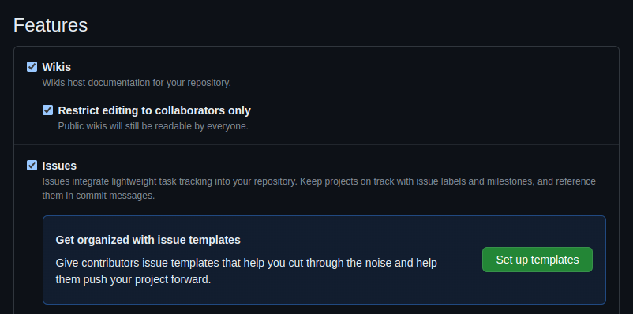
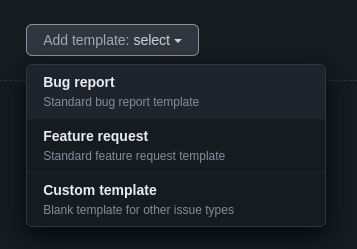
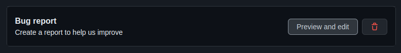
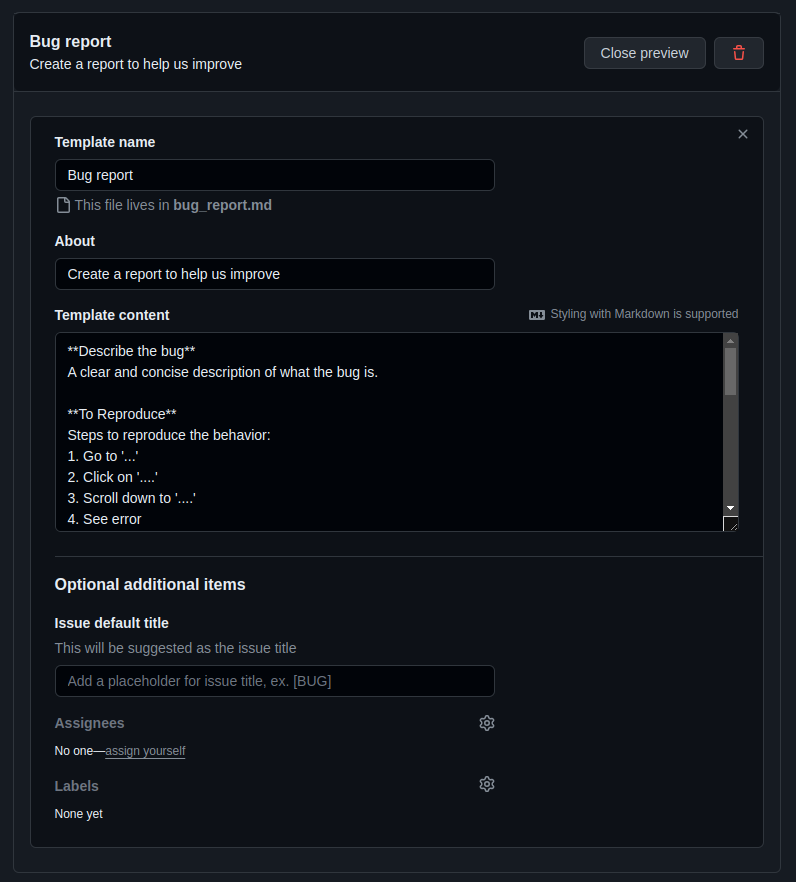
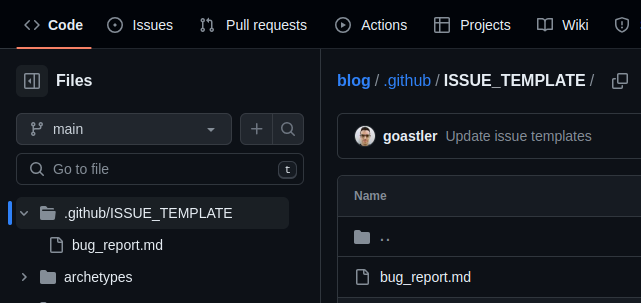

<!-- 
write a professional article on the following content. Use emojis. Make a short and snappy title for the article, but keep it specific to the content. Always welcome the user first of all. Then tell them what the article is about and why it is helpful to them. Tell them what they'll need in terms of tools and understanding. Tell them how much time they'll follow along. At the end, thank them for reading the article and write a short, snappy summary which encourages them to stay tuned for more great articles. Do not discard any content. Do not reduce any content. Put the output in markdown format. After writing the article, wrap it in a code block.


explain how In any github repo, I like to setup several issue templates to aid documentation of development and issues related to the project. In this post, we're going to go over my tried-and-tested templates and explain the purpose of each field. I encourage you to use these in your own repos. As an aside, I use these for all repos I produce, even when I am the sole dev. It means that all the history of PRs, issues, etc is properly documented, so future me has far less of a headache. Likewise, if any other contributors join the project they have good resources to work from rather than my undocumented PRs and issues!

Here's the breakdown of what I include in a bug report and why:
- summary
    - a quick overview of the issue - helpful for categorisation / getting the right person on the job
    - description
        - document the issue
    - steps to reproduce 
        - arguably the most important part of a bug report
        - getting the issue reproduced on someone else's computer validates the issue you're experiencing
        - devs have to reproduce the issue first in order to fix it!
        - including screenshots/recordings is incredibly helpful to see exactly what the person is doing to achieve these results
    - expected results
        - good for checking the person has correct understanding of what their code does vs what they think it does
    - actual results
        - what's actually happening, helpful if not reproducible
    - details on the reproducibility, e.g. frequency, consistency and regression.
        - these are often left out when someone is reporting a bug. It's crucial to know how the bug is being experienced in order to solve it. It's especially helpful to know if the problem has occured _since_ a specific version when everything was working before, which makes tracking down the problem much easier.
    - environment + versions
        - getting hardware and software details can exhibit some interesting setups which indicate incompatibilities from the targeted hardware / software. This can often uncovered why an issue is occuring without reproducing it. It can also highlight operating system or hardware specific issues which are difficult to build universal coverage for when testing.
        - this is of course needed for reproducibility
    - additional info and labels
        - allows the reporter to give extra context and provide some keywords, which can be used to automatically categorise issues
- you can add the bug report template to your github repo by going to settings, enabling issues and setting up a bug report template
    - 
    - Click "setup templates"
- Setup a new bug report template
    - 
- Edit the new bug report template
    - 
    - 
- Alternatively, edit the file directly in the repo
    - it's under `./github/ISSUE_TEMPLATE/<template name>.md`
    - 
- explain how I like to edit the file directly rather than use the github settings preview and edit tool.
- explain how they can copy and paste my bug report template from below into their repo

```
**Bug Report Template**

**Summary:**
A concise summary of the issue.

**Description:**
Describe the issue in detail. Include any error messages, unexpected behavior, or other relevant information. 

**Steps to Reproduce: (including screenshots/recordings as necessary!)**
1. Step 1: [Describe the first step to reproduce the issue]
2. Step 2: [Describe the second step to reproduce the issue]
3. Step 3: [Describe any subsequent steps to reproduce the issue]

**Expected Result:**
Describe what you expected to happen when performing the steps above.

**Actual Result:**
Describe what actually happened when performing the steps above.

**Reproducibility:**
Specify whether the issue is reproducible consistently, intermittently, or only under specific conditions.

**Frequency:**
Indicate how frequently the issue occurs (e.g., always, occasionally, rarely).

**Regression:**
Indicate whether the issue is a regression (i.e., it worked in a previous version but is broken in the current version).

**Environment:**
- Hardware: [e.g. CPU, GPU, RAM, etc.]
- Operating System: [e.g., Windows 10, macOS Big Sur]
- Browser (if applicable): [e.g., Chrome, Firefox]
- Version/Build Number: [e.g., 1.0.0]
- Any other relevant information about your environment.

**Affected Versions:**
Specify the version(s) of the software in which the bug is observed.

**Additional Information:**
Any additional information or context that might be helpful in understanding or resolving the issue. Include any error logs, stack traces, or console output related to the issue.

**Tags/Labels:**
Use tags or labels to categorize the bug (e.g., "UI," "Backend," "Security," "Performance").

```
- Commit/push/merge
    - The templates must be in the `main` branch in order to be active
    
     -->


# 🐛 Setting Up Effective Bug Report Templates on GitHub

Welcome, GitHub enthusiasts! 🎉 In this article, we're diving into the world of issue templates on GitHub, specifically focusing on bug reports. If you're keen on enhancing your project documentation and making issue tracking smoother, you're in the right place!

## Why You Need Effective Bug Report Templates

Ever found yourself struggling to understand a bug report? Or perhaps spent hours trying to reproduce an issue only to realize crucial details were missing? Fear not! 🛠️ With well-crafted bug report templates, you can streamline communication, ensure essential details are captured, and expedite issue resolution.

## What You'll Need

To follow along, you'll need:
- Basic understanding of GitHub repositories
- Access to repository settings to enable issues and set up templates
- Familiarity with Markdown for customizing templates

## Time Investment

Fear not, dear reader! 🕒 Implementing these templates won't eat up your entire day. With a few minutes spent setting up, you'll save countless hours down the road navigating through vague issue reports.

## Let's Dive In!

### What Goes into a Bug Report Template?

Here's a breakdown of the essential fields and their purposes:

- **Summary**: Quick overview for categorization.
- **Description**: Detailed documentation of the issue.
- **Steps to Reproduce**: Crucial for validating and reproducing the issue.
- **Expected Results**: Ensures correct understanding of expected behavior.
- **Actual Results**: Provides insight into what's actually happening.
- **Reproducibility Details**: Frequency, consistency, and regression information.
- **Environment + Versions**: Hardware, software, and version details.
- **Additional Info and Labels**: Extra context and categorization.

### Setting Up Your Bug Report Template

1. **Enable Issues**: Go to repository settings and enable issues.
   
   
1. **Setup Templates**: Click "Setup Templates."
   
   
1. **Create Bug Report Template**: Add a new bug report template.
   
   
1. **Edit Template**: Customize the bug report template as per your requirements.
   

    Alternatively, you can directly edit the template file in your repository:
    - Locate the file under `./github/ISSUE_TEMPLATE/<template name>.md`.
    

### Copy the Template

For your convenience, here's the bug report template you can copy and paste into your repository:

```
**Bug Report Template**

**Summary:**
A concise summary of the issue.

**Description:**
Describe the issue in detail. Include any error messages, unexpected behavior, or other relevant information. 

**Steps to Reproduce: (including screenshots/recordings as necessary!)**
1. Step 1: [Describe the first step to reproduce the issue]
2. Step 2: [Describe the second step to reproduce the issue]
3. Step 3: [Describe any subsequent steps to reproduce the issue]

**Expected Result:**
Describe what you expected to happen when performing the steps above.

**Actual Result:**
Describe what actually happened when performing the steps above.

**Reproducibility:**
Specify whether the issue is reproducible consistently, intermittently, or only under specific conditions.

**Frequency:**
Indicate how frequently the issue occurs (e.g., always, occasionally, rarely).

**Regression:**
Indicate whether the issue is a regression (i.e., it worked in a previous version but is broken in the current version).

**Environment:**
- Hardware: [e.g. CPU, GPU, RAM, etc.]
- Operating System: [e.g., Windows 10, macOS Big Sur]
- Browser (if applicable): [e.g., Chrome, Firefox]
- Version/Build Number: [e.g., 1.0.0]
- Any other relevant information about your environment.

**Affected Versions:**
Specify the version(s) of the software in which the bug is observed.

**Additional Information:**
Any additional information or context that might be helpful in understanding or resolving the issue. Include any error logs, stack traces, or console output related to the issue.

**Tags/Labels:**
Use tags or labels to categorize the bug (e.g., "UI," "Backend," "Security," "Performance").

```
### Commit/push/PR/merge
The templates must be in the `main` branch in order to be active

Thanks for reading, have a great day! 😎