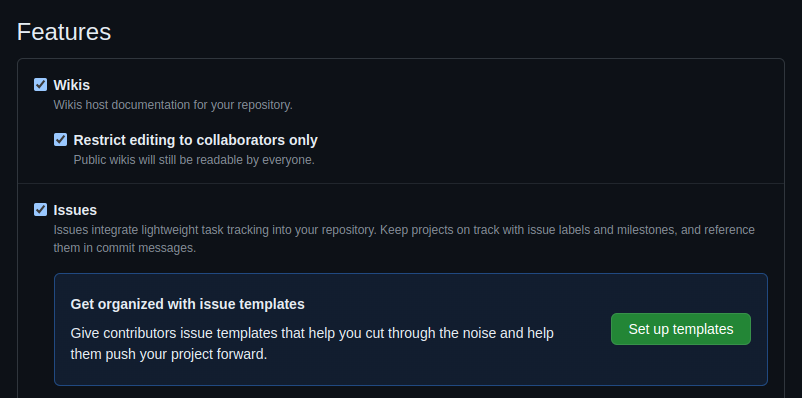
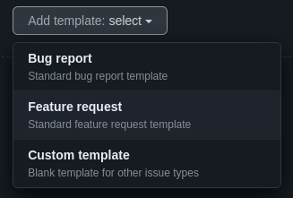
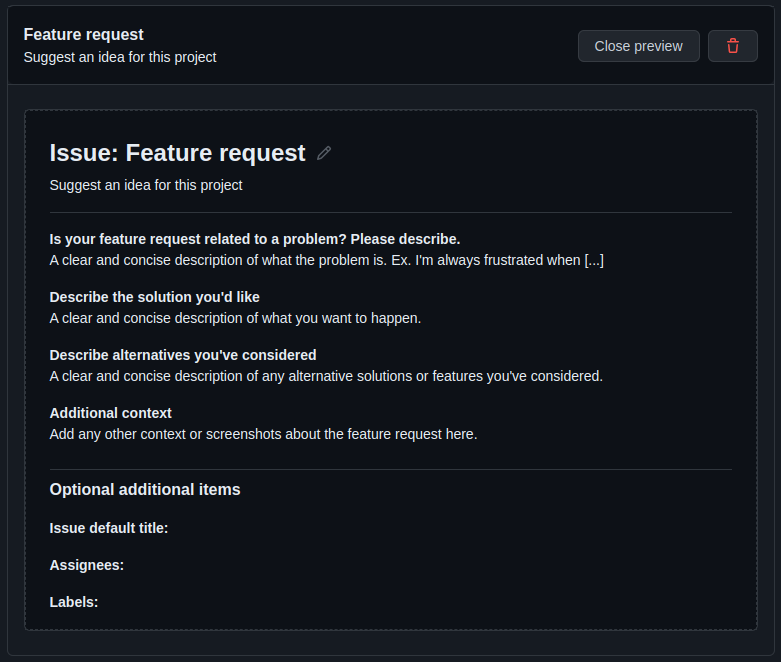
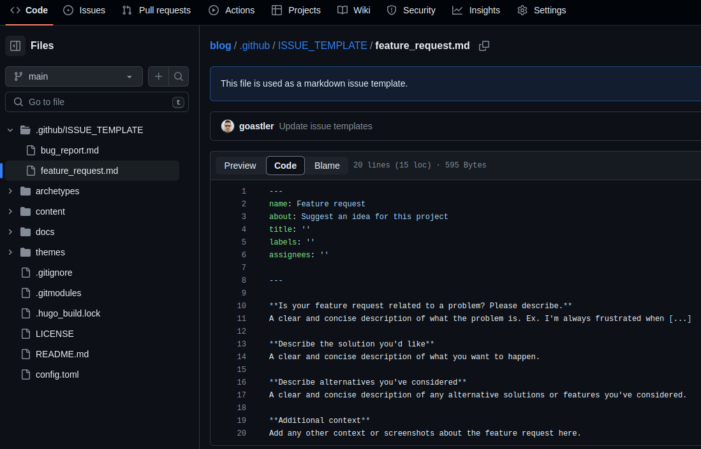

<!-- write a professional article on the following content. Use emojis. Make a short and snappy title for the article, but keep it specific to the content. Always welcome the user first of all. Then tell them what the article is about and why it is helpful to them. Tell them what they'll need in terms of tools and understanding. Tell them how much time they'll follow along. At the end, thank them for reading the article and write a short, snappy summary which encourages them to stay tuned for more great articles. Do not discard any content. Do not reduce any content. Put the output in markdown format. After writing the article, wrap it in a code block.

- a feature request template is needed to fully understand and refine a feature before going ahead with implementation
- it's crucial to identify potential hurdles and contextual consequences of the features
- a feature request template forces the feature to become well-thought-out and finite in specification, making it much easier to implement
- discussion of feature and context is encouraged
- below is a feature template which is a one-size-fits-all solution. The aim is to hit all possible factors which a feature request may need to consider. I expect the majority of repos will not need half of the factors listed, but they're all good to consider.

[feature request template here] 

- How to add the feature request template to github
- 

-->

# Unlocking Seamless Features: Your Ultimate Feature Request Template 🚀

Welcome, Feature Enthusiast! Ever wondered how to ensure your feature requests hit the mark every time? 🎯 Look no further! In this article, we'll introduce you to the power of a feature request template and how it can revolutionize your development process.

## Why You Need a Feature Request Template

Picture this: You have a brilliant idea for a new feature, but before diving headfirst into implementation, it's essential to refine and understand it fully. 🤔 This is where a feature request template comes into play. By structuring your thoughts and requirements, you not only identify potential hurdles but also contextual consequences, ensuring your feature aligns seamlessly with your project goals. 💡

## What You'll Need

To follow along, all you need is your creative idea and a willingness to dive deep into its intricacies. Whether you're a seasoned developer or a budding entrepreneur, this template caters to all levels of expertise. 🛠️

## How Much Time?

Fear not! We've streamlined the process to make it as efficient as possible. You can expect to spend no more than 30 minutes refining your feature request using our template. Time well spent for a smoother development journey! ⏱️

## The Feature Request Template

Without further ado, let's unveil our one-size-fits-all solution.

This comprehensive template covers all bases, from technical specifications to user experience considerations. While it may seem extensive, remember, it's better to over-prepare than to under-deliver! 📋

```
**Title/Summary:**
[Provide a brief but descriptive title or summary of the feature request]

**Description:**
[Explain the feature in detail. What problem does it solve? How will it benefit users? Include any relevant context or examples.]

**Use Case(s):**
[Describe specific scenarios where this feature would be useful. This could include common tasks, workflows, or challenges that users face.]

**Proposed Solution:**
[Outline the proposed solution to implement the feature. This could include technical details, interface changes, or integration with existing features.]

**Benefits:**
[List the benefits of implementing this feature, such as improved user experience, increased productivity, or enhanced functionality.]

**Potential Challenges:**
[Identify any potential challenges or drawbacks of implementing the feature. This could include technical limitations, resource constraints, or compatibility issues.]

**Market research:**
[Research the demand for this feature. Is there a clear need or request from users?]

**Roadmap Alignment:**
[Assess how this feature fits into the overall product roadmap. Does it align with the strategic goals of the project?]

**Impact Analysis:**
[Analyze the potential impact of implementing this feature on users, stakeholders, and the product as a whole.]

**Dependencies:**
[List any dependencies that need to be addressed before implementing this feature, such as third-party integrations or infrastructure requirements.]

**Acceptance Criteria:**
[Define the criteria that must be met for this feature to be considered complete and ready for release.]

**Testing Plan:**
[Outline the plan for testing this feature, including any specific test cases or scenarios that need to be covered.]

**Localization/Internationalization:**
[Consider any localization or internationalization requirements for this feature, such as language support or cultural considerations.]

**Security and Compliance:**
[Address any security or compliance concerns related to implementing this feature, such as data privacy or regulatory requirements.]

**Performance Metrics:**
[Define the metrics that will be used to measure the performance of this feature once it is implemented.]

**Feedback Mechanism:**
[Establish a mechanism for collecting feedback from users once the feature is released, such as surveys or user feedback forums.]

**Cost/Benefit Analysis:**
[Conduct a cost-benefit analysis to evaluate the potential ROI of implementing this feature.]

**Alternative Solutions Considered:**
[Discuss any alternative solutions that were considered and why they were not chosen.]

**Suggested Implementation Timeline:**
[Provide a suggested timeline for implementing this feature, taking into account development resources and priorities.]

**Resource Allocation:**
[Determine the resources (e.g., budget, personnel) needed to implement this feature.]

**Documentation Requirements:**
[Identify any documentation that will need to be created or updated as a result of implementing this feature.]

**Legal and Intellectual Property Considerations:**
[Address any legal or intellectual property considerations associated with implementing this feature, such as patents or licensing agreements.]

**Compatibility Requirements:**
[Consider any compatibility requirements with existing systems or platforms.]

**Scalability Considerations:**
[Evaluate the scalability of this feature and any potential limitations or challenges.]

**User Interface/Experience Design:**
[Discuss the user interface and experience design considerations for this feature, including any changes to the UI/UX.]

**Regulatory Compliance:**
[Ensure that the feature complies with relevant regulations and standards.]

**Success Metrics:**
[Define the key metrics that will indicate the success of this feature once it is implemented.]

**Competitive Analysis:**
[Analyze how this feature compares to similar features offered by competitors.]

**Technical Debt Considerations:**
[Address any technical debt that may need to be resolved before or during implementation.]

**Sustainability Impact:**
[Assess the sustainability impact of implementing this feature, including any environmental or social considerations.]

**Third-Party Integrations:**
[Consider any third-party integrations that may be required for this feature to function properly.]

**Additional Information:**
[Any additional information, research, or references that support the feature request.]

**Attachments:**
[Attach any relevant documents, mockups, or diagrams that support the feature request.]

```

**Title/Summary:**

The title and summary of your feature request serve as the initial handshake with stakeholders and developers alike. This concise introduction should encapsulate the essence of your proposal, providing a glimpse into the problem you aim to solve and the value your feature brings. Think of it as the elevator pitch for your idea, compelling readers to delve deeper into your request.

---

**Description:**

At the core of every successful feature request lies a comprehensive description. This section acts as the narrative backbone of your proposal, offering a detailed exploration of the problem domain, the proposed solution, and the anticipated benefits. It's essential to provide sufficient context and clarity to ensure stakeholders fully grasp the scope and significance of your feature.

---

**Use Case(s):**

One of the cornerstones of effective feature development is a thorough understanding of its practical applications. Use cases provide invaluable insight into how your feature will be utilized in real-world scenarios, guiding developers in crafting solutions that align with user needs and expectations. By illustrating specific use cases, you offer stakeholders a tangible glimpse into the transformative potential of your feature.

---

**Proposed Solution:**

In this section, you transition from problem identification to solution design. Here, you outline your proposed approach to implementing the feature, including technical specifications, architectural considerations, and any necessary integrations with existing systems. A well-defined proposed solution not only facilitates development planning but also fosters alignment and consensus among stakeholders.

---

**Benefits:**

Features are developed with the ultimate goal of delivering value to users and stakeholders. In this section, you articulate the myriad benefits that your proposed feature brings to the table, whether it's enhancing user experience, increasing operational efficiency, or driving business growth. Clearly communicating the value proposition of your feature is essential for garnering support and buy-in from decision-makers.

---

**Potential Challenges:**

While every feature request is fueled by optimism and innovation, it's crucial to acknowledge and address potential challenges that may arise during implementation. This section provides an opportunity to identify technical constraints, resource limitations, or compatibility issues that could impact the successful delivery of your feature. By proactively identifying and mitigating potential challenges, you set the stage for a smoother development process.

---

**Market research:**

Before advocating for the implementation of a new feature, it's imperative to conduct thorough market research to validate its viability and relevance. This section involves analyzing user needs, assessing competitor offerings, and gauging market trends to ensure that your feature aligns with market demands and strategic objectives. By grounding your feature request in sound market research, you bolster its credibility and increase the likelihood of adoption and success.

---

**Roadmap Alignment:**

Successful product development hinges on the seamless alignment of individual features with the overarching product roadmap. In this section, you evaluate how your feature request fits within the broader strategic vision and development timeline of the product. By ensuring alignment with strategic goals and priorities, you foster coherence and continuity in the product development process, maximizing the impact and value of your feature.

---

**Impact Analysis:**

Features have the power to catalyze significant changes within a product ecosystem, influencing user behavior, business metrics, and competitive positioning. In this section, you delve into the potential impact of your feature on key performance indicators, user engagement, and overall product success. Through rigorous analysis and forecasting, you provide stakeholders with valuable insights into the expected outcomes and implications of implementing your feature.

---
---

**Dependencies:**

No feature exists in isolation; many are interconnected with other aspects of the system. In this section, you outline any dependencies that your feature has on external components, services, or technologies. By identifying dependencies upfront, you enable effective planning and coordination across development teams, reducing the risk of delays or bottlenecks during implementation.

---

**Acceptance Criteria:**

Clear and concise acceptance criteria are essential for defining the success criteria of your feature. This section specifies the conditions that must be met for the feature to be considered complete and ready for deployment. By establishing objective criteria for evaluation, you provide a framework for stakeholders to assess the readiness and quality of the feature.

---

**Testing Plan:**

Quality assurance is a critical aspect of feature development, ensuring that the implemented solution meets the specified requirements and functions as intended. In this section, you outline your testing plan, including the types of tests to be conducted, testing methodologies, and acceptance criteria. By defining a comprehensive testing strategy, you mitigate the risk of defects and errors, delivering a robust and reliable feature to users.

---

**Localization/Internationalization:**

In today's globalized world, catering to diverse audiences often requires support for multiple languages and cultural preferences. This section addresses the localization and internationalization requirements of your feature, ensuring that it can be adapted to different regions and languages without compromising functionality or user experience. By incorporating localization considerations early in the development process, you pave the way for seamless expansion into new markets.

---

**Security and Compliance:**

Security and compliance are non-negotiable aspects of feature development, especially in industries with stringent regulatory requirements. This section outlines the security measures and compliance standards that your feature must adhere to, ensuring the protection of sensitive data and the mitigation of potential risks. By prioritizing security and compliance considerations, you uphold the trust and integrity of your product, safeguarding both users and stakeholders.

---

**Performance Metrics:**

Performance is a key determinant of user satisfaction and product success. In this section, you define the performance metrics that will be used to evaluate the efficiency, responsiveness, and scalability of your feature. By establishing clear performance benchmarks, you enable continuous monitoring and optimization, ensuring that your feature delivers optimal performance under varying conditions and workloads.

---

**Feedback Mechanism:**

Effective communication and feedback are essential for refining and improving your feature over time. This section outlines the mechanisms and channels through which users can provide feedback and suggestions for future enhancements. By fostering an open and collaborative feedback loop, you empower users to actively participate in the evolution of the product, driving innovation and customer satisfaction.

---

**Cost/Benefit Analysis:**

Every feature incurs costs, whether in terms of development resources, infrastructure, or ongoing maintenance. This section conducts a thorough cost-benefit analysis to evaluate the return on investment (ROI) of implementing your feature. By weighing the potential costs against the anticipated benefits, you provide stakeholders with valuable insights into the financial implications and potential value proposition of your feature.

---

**Alternative Solutions Considered:**

Innovation often involves exploring multiple paths before arriving at the optimal solution. This section discusses alternative solutions that were considered during the feature ideation process, highlighting their strengths, weaknesses, and rationale for their exclusion. By transparently documenting alternative approaches, you demonstrate thorough consideration and decision-making, enhancing stakeholders' confidence in the chosen solution.

---

**Suggested Implementation Timeline:**

A well-defined timeline is essential for effectively planning and executing feature development. In this section, you propose an implementation timeline that outlines key milestones, deliverables, and dependencies for your feature. By providing a clear roadmap for development and deployment, you enable stakeholders to manage expectations, allocate resources, and track progress effectively.

---

**Resource Allocation:**

Successful feature development requires adequate allocation of resources, including human capital, budget, and infrastructure. This section addresses the resource requirements and constraints associated with implementing your feature, ensuring that sufficient resources are allocated to support its development and deployment. By aligning resource allocation with strategic priorities and project timelines, you optimize efficiency and maximize the likelihood of success.

---

**Documentation Requirements:**

Comprehensive documentation is essential for ensuring the successful adoption and maintenance of your feature. This section outlines the documentation requirements, including user guides, technical specifications, and API documentation. By providing clear and accessible documentation, you empower users and developers to understand and utilize your feature effectively, reducing the barrier to entry and promoting widespread adoption.

---

**Legal and Intellectual Property Considerations:**

Legal and intellectual property considerations play a crucial role in feature development, particularly in industries with complex regulatory frameworks and intellectual property rights. This section addresses any legal requirements, patents, trademarks, or licensing agreements that may impact the implementation or distribution of your feature. By proactively addressing legal considerations, you mitigate the risk of legal disputes or infringements, safeguarding the integrity and legality of your product.

---

**Compatibility Requirements:**

Compatibility with existing systems, platforms, and technologies is essential for seamless integration and interoperability. This section outlines the compatibility requirements and considerations for your feature, ensuring that it can be effectively deployed within the existing ecosystem. By addressing compatibility requirements early in the development process, you minimize the risk of compatibility issues and streamline the integration process.

---

**Scalability Considerations:**

Scalability is a critical factor in feature development, especially for products experiencing rapid growth or fluctuating demand. This section addresses the scalability considerations and requirements for your feature, ensuring that it can accommodate increasing workloads and user volumes without sacrificing performance or reliability. By designing for scalability from the outset, you future-proof your feature and position it for long-term success and growth.

---

**User Interface/Experience Design:**

User interface (UI) and user experience (UX) design are pivotal aspects of feature development, shaping how users interact with and perceive your product. This section addresses the UI/UX design requirements and considerations for your feature, ensuring that it delivers intuitive, engaging, and accessible user experiences. By prioritizing user-centric design principles and best practices, you enhance user satisfaction, retention, and loyalty, driving the success of your feature.

---

**Regulatory Compliance:**

Regulatory compliance is a fundamental requirement for feature development, particularly in industries subject to stringent regulations and standards. This section addresses the regulatory compliance requirements and considerations for your feature, ensuring that it meets legal, industry, and security standards. By adhering to regulatory requirements, you mitigate the risk of non-compliance and legal liabilities, fostering trust and confidence among users and stakeholders.

---

**Success Metrics:**

Defining success metrics is essential for evaluating the impact and effectiveness of your feature. This section outlines the key performance indicators (KPIs) and success metrics that will be used to measure the success of your feature. By establishing clear, quantifiable metrics, you enable stakeholders to track progress, evaluate performance, and make data-driven decisions to optimize the impact and value of your feature.

---

**Competitive Analysis:**

Understanding the competitive landscape is crucial for positioning your feature effectively and identifying opportunities for differentiation. This section conducts a comprehensive competitive analysis, benchmarking your feature against competitors' offerings, strengths, and weaknesses. By gaining insights into market trends, competitor strategies, and user preferences, you inform feature prioritization, innovation, and marketing efforts, enhancing your product's competitiveness and market positioning.

---

**Technical Debt Considerations:**

Technical debt is an inevitable consequence of feature development, accruing when expedient solutions are chosen over optimal ones. This section addresses the technical debt considerations associated with your feature, including areas of code complexity, architectural debt, and legacy dependencies. By acknowledging and managing technical debt proactively, you mitigate the risk of future development bottlenecks, code quality issues, and maintenance challenges, ensuring the long-term sustainability and scalability of your product.

---

**Sustainability Impact:**

Sustainability is an increasingly important consideration in feature development, reflecting the environmental, social, and ethical dimensions of product design and usage. This section assesses the sustainability impact of your feature, considering factors such as energy consumption, carbon footprint, and resource efficiency. By incorporating sustainable design principles and practices, you minimize environmental impact, promote social responsibility, and align with evolving consumer expectations and regulatory requirements.

---

**Third-Party Integrations:**

Integration with third-party services, APIs, and platforms can extend the functionality and reach of your feature, enhancing its value and utility. This section outlines the third-party integrations and dependencies required for your feature, ensuring seamless interoperability and compatibility. By leveraging existing services and ecosystems, you accelerate development, reduce development costs, and unlock new opportunities for innovation and collaboration.


## How to add the Feature Request template to GitHub

1. **Enable Issues**: Go to repository settings and enable issues.
   
   
1. **Setup Templates**: Click "Setup Templates."
   
   
1. **Create Feature Request Template**: Add a new Feature Request template.
    
   
1. **Edit Template**: Customize the Feature Request template as per your requirements.
   

    Alternatively, you can directly edit the template file in your repository:
    - Locate the file under `./github/ISSUE_TEMPLATE/<template name>.md`.
    

1. Commit/push/PR/merge
The templates must be in the `main` branch in order to be active

## Conclusion

Thank you for embarking on this feature-filled journey with us! By leveraging a feature request template, you're not only ensuring your ideas come to fruition but also fostering meaningful discussions around them. Stay tuned for more insightful articles, and remember, the template is just the beginning of your feature-packed adventures! 🚀