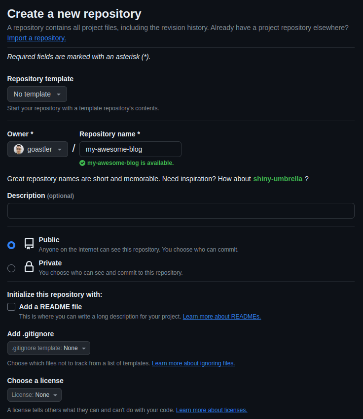
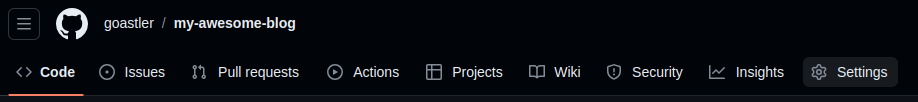
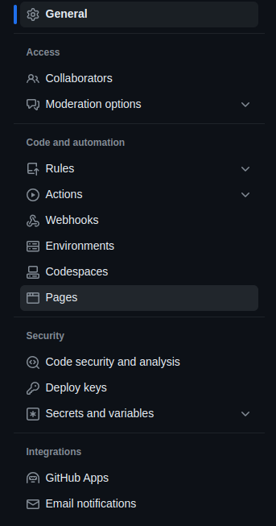
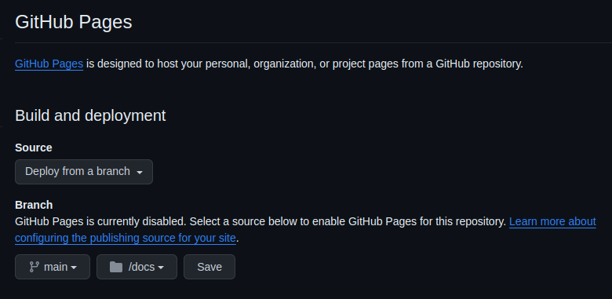
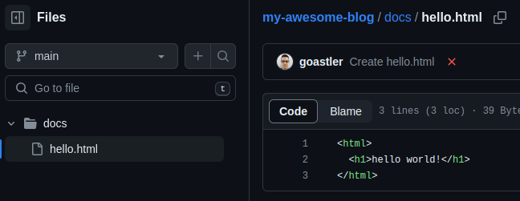
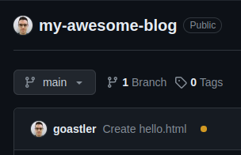
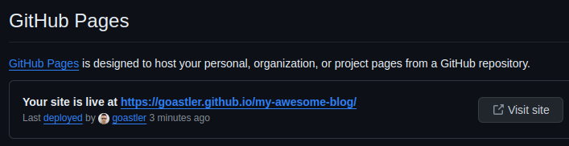
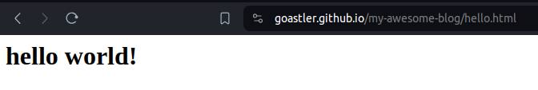

<!-- 

write a professional article on the following content. Use emojis. Make a short and snappy title for the article, but keep it specific to the content. Always welcome the user first of all. Then tell them what the article is about and why it is helpful to them. Tell them what they'll need in terms of tools and understanding. Tell them how much time they'll follow along. At the end, thank them for reading the article and write a short, snappy summary which encourages them to stay tuned for more great articles. Do not discard any content. Put the output in markdown format. After writing the article, wrap it in a code block.

- explain what gh pages is
    - gh pages is a static resource hosting service
    - it works by hosting files in your repo
    - it's simple and easy to maintain via git and github
- we can generate the site and put the result in the repo to be hosted by github for free
- explain what a static generated site is
    - a statically generated site is non-dynamic content, i.e. doesn't need a server
- explain how gh pages can serve a staticly generated site
- explain how this website is static content, so is being served via gh pages
1. [make a github repo](https://github.com/new)
    
    - create a new github repo for your website.
    - Make sure to make the repo public, as you can't host content via github pages on private repos.
1. go to settings
    
    
1. configure github pages
    - there's two ways of deploying pages: via github actions or via a branch. 
    - The former is the beta, new version which I won't go into in this post. 
    - The latter is what we'll be using today. 
    - Essentially, github uses a specific branch for hosting your content. 
    - I've set this to the main branch, but you could set it to any branch you like. 
    - You have to choose between putting your content to be hosted in the root of the repo (i.e. '/') or in the docs folder (i.e. '/docs/'). 
    - I prefer the docs folder, as this keeps all your hosted content in one place away from any files in the root of your repo that you may not want to be hosted on your site!
    - Remember to hit 'Save' to apply your changes.
    
1. make some content in the docs folder. Here I've made a little "Hello world" html file
    
1. the branch on your github repo will trigger a github actions job. 
    - this has nothing to do with the github actions version of github pages I mentioned before. 
    - Simply, github uses github actions to process the changes you've made in the /docs/ folder and host your static site. As soon as the orange dot changes to a tick, your changes sould be live.
    
    
1. github pages sites are hosted at `<your github username>.github.io/<your repo name>`, but you can also find the url in the github pages settings we were on before.
    
1. let's visit the site!
    
    - I'm hosting a specific page here (hello.html).
    - If you'd like a default page, you need an index.html file.

- and there we have it, a quick and simple tutorial on how to host static content on github pages -->
# How to Host Your Website on GitHub Pages 🚀

Welcome, fellow developer! Are you looking for an easy and free way to host your website or project online? Look no further than GitHub Pages. In this tutorial, I'll guide you through the process of hosting static content on GitHub Pages, making your project accessible to the world with just a few simple steps.

### What is GitHub Pages?

GitHub Pages is a static resource hosting service provided by GitHub. It allows you to host your website directly from your GitHub repository. This means you can easily maintain and update your site using Git and GitHub's familiar interface.

### Why Use GitHub Pages?

Hosting your site on GitHub Pages is free, simple, and requires minimal maintenance. It's perfect for showcasing your projects, personal websites, or documentation.

### What You'll Need:

- Basic understanding of Git and GitHub
- An HTML file or static content for your website

### Time Required:

Following this tutorial should take you no more than 15 minutes.

1. **Create a GitHub Repo:**
   Start by creating a new public repository on GitHub for your website. Make sure it's public, as GitHub Pages cannot host content from private repos.

   

2. **Go to Settings:**
   In your repository, navigate to the Settings tab.

   
   

3. **Configure GitHub Pages:**
   Under the Settings tab, find the GitHub Pages section. Choose the branch where your site's source code resides (usually main) and select the folder (root or docs) containing your site's content. Click 'Save' to apply your changes.

   

4. **Create Content:**
   Add your website's content to the selected folder. For example, you can create an "index.html" file for your homepage.

   

5. **Wait for GitHub Actions:**
   GitHub Pages uses GitHub Actions to process changes and host your site. Once you've made changes to your content, GitHub Actions will automatically trigger a build process.

   
   

6. **Find Your Site URL:**
   Your site will be hosted at `<your GitHub username>.github.io/<your repo name>`. You can also find the URL in the GitHub Pages settings.

   

7. **Visit Your Site:**
   Voila! Your site is now live. Visit the URL to see your hosted content in action.

   

And there you have it! In just a few steps, you've successfully hosted your static content on GitHub Pages. Whether it's a personal portfolio or a project showcase, GitHub Pages makes it easy to share your work with the world.

Thank you for reading! Stay tuned for more helpful tutorials and tips. Happy coding! 🌟
