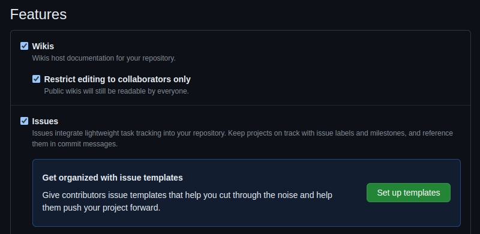

<!-- 

write a professional article on the following content. Use emojis. Make a short and snappy title for the article, but keep it specific to the content. Always welcome the user first of all. Then tell them what the article is about and why it is helpful to them. Tell them what they'll need in terms of tools and understanding. Tell them how much time they'll follow along. At the end, thank them for reading the article and write a short, snappy summary which encourages them to stay tuned for more great articles. Do not discard any content. Put the output in markdown format. After writing the article, wrap it in a code block.

- explain what gh pages is
    - gh pages is a static resource hosting service
    - it works by hosting files in your repo
    - it's simple and easy to maintain via git and github
- we can generate the site and put the result in the repo to be hosted by github for free
- explain what a static generated site is
    - a statically generated site is non-dynamic content, i.e. doesn't need a server
- explain how gh pages can serve a staticly generated site
- explain how this website is static content, so is being served via gh pages
1. [make a github repo](https://github.com/new)
    
    - create a new github repo for your website.
    - Make sure to make the repo public, as you can't host content via github pages on private repos.
1. go to settings
    
    
1. configure github pages
    - there's two ways of deploying pages: via github actions or via a branch. 
    - The former is the beta, new version which I won't go into in this post. 
    - The latter is what we'll be using today. 
    - Essentially, github uses a specific branch for hosting your content. 
    - I've set this to the main branch, but you could set it to any branch you like. 
    - You have to choose between putting your content to be hosted in the root of the repo (i.e. '/') or in the docs folder (i.e. '/docs/'). 
    - I prefer the docs folder, as this keeps all your hosted content in one place away from any files in the root of your repo that you may not want to be hosted on your site!
    - Remember to hit 'Save' to apply your changes.
    
1. make some content in the docs folder. Here I've made a little "Hello world" html file
    
1. the branch on your github repo will trigger a github actions job. 
    - this has nothing to do with the github actions version of github pages I mentioned before. 
    - Simply, github uses github actions to process the changes you've made in the /docs/ folder and host your static site. As soon as the orange dot changes to a tick, your changes sould be live.
    
    
1. github pages sites are hosted at `<your github username>.github.io/<your repo name>`, but you can also find the url in the github pages settings we were on before.
    
1. let's visit the site!
    
    - I'm hosting a specific page here (hello.html).
    - If you'd like a default page, you need an index.html file.

- and there we have it, a quick and simple tutorial on how to host static content on github pages -->